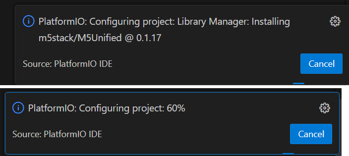
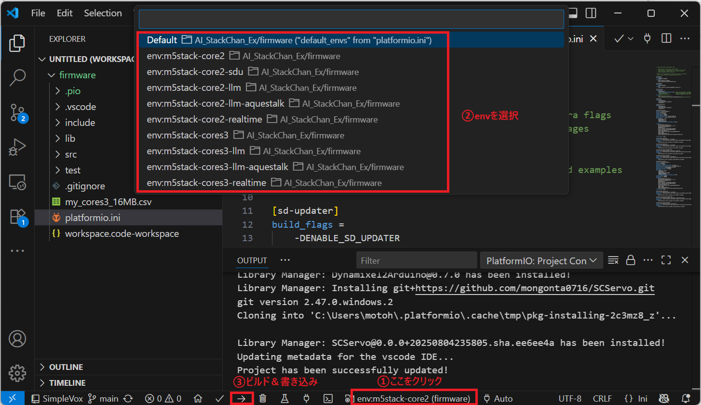

[日本語](README.md)

# AI Stack-chan Ex
Based on robo8080's [AI Stack-chan](https://github.com/robo8080/AI_StackChan2), we have added the following functions.  
- Added new AI services (new services in bold)
  - LLM: OpenAI ChatGPT / **ModuleLLM**
  - STT: OpenAI Whisper / Google Cloud STT / **ModuleLLM ASR**
  - TTS: **OpenAI TTS** / WEB VOICEVOX / **ElevenLabs** / **AquesTalk** / **ModuleLLM TTS**
  - Wake Word: SimpleVox / **ModuleLLM KWS**
- Compatible with [stackchan-arduino library](https://github.com/mongonta0716/stackchan-arduino)
  - This makes it possible to use YAML for initial configuration and support for serial servos.
- Class design that makes it easy to create additional user applications


> Stack-chan is a super-kawaii palm-sized communication robot developed and released by [Shishikawa-san](https://x.com/stack_chan).
>- [Github](https://github.com/stack-chan/stack-chan)
>- [Discord](https://discord.com/channels/1095725099925110847/1097878659966173225)
>- [ScrapBox](https://scrapbox.io/stack-chan/)

<br>

---
**Table of Contents**
- [Development environment](#development-environment)
- [Available AI services](#available-ai-services)
  - [LLM](#llm)
  - [Speech to Text (STT)](#speech-to-text-stt)
  - [Text to Speech (TTS)](#text-to-speech-tts)
  - [Wake Word](#wake-word)
- [How to use](#how-to-use)
  - [Initial setup with YAML](#initial-setup-with-yaml)
  - [Build \& Flash](#build--flash)
- [Other features](#other-features)
  - [About creating a user application](#about-creating-a-user-application)
  - [Supports SD Updater (Core2 only)](#supports-sd-updater-core2-only)
  - [Face detection by camera (CoreS3 only)](#face-detection-by-camera-cores3-only)
- [About contributions](#about-contributions)
- [Notes](#notes)


## Development environment
- Target device：M5Stack Core2 / CoreS3
- Development PC：
  - OS: Windows11 
  - IDE：VSCode + PlatformIO

## Available AI services
This shows the support status of various AI services required for conversation.  
You can select which AI service to use by configuring the YAML file on the SD card (you will need to obtain an API key separately).

### LLM
|   |Local execution|Japanese|English|Remarks|
|---|---|---|---|---|
|OpenAI ChatGPT|×|〇|〇|・You need to get an API key<br>・Supports Function Calling. [Details page](doc/function_calling_en.md)<br>・Supports MCP. [Details page](doc/mcp_en.md)<br>・🆕Supports Realtime API .[Details page](doc/realtime_api_en.md)<br>・CoreS3 camera images can be input. [Details page](doc/gpt4o_cores3camera_en.md)|
|ModuleLLM|〇|〇|〇| Please check [How to set up ModuleLLM](doc/module_llm_en.md). <br>Function calling is also supported (see [Appendix B on the same page](doc/module_llm_en.md#appendix-a-how-to-implement-function-calling)).|

### Speech to Text (STT)

|   |Local execution|Japanese|English|Remarks|
|---|---|---|---|---|
|Google Cloud STT|×|〇|〇| You need to get an API key|
|OpenAI Whisper|×|〇|〇| You need to get an API key (You can use a common API key with OpenAI ChatGPT)|
|ModuleLLM ASR|〇|×|〇| Please check [How to set up ModuleLLM](doc/module_llm_en.md) |

### Text to Speech (TTS)

|   |Local execution|Japanese|English|Remarks|
|---|---|---|---|---|
|Web版VoiceVox|×|〇|×| You need to get an API key|
|ElevenLabs|×|〇|〇| You need to get an API key|
|OpenAI TTS|×|〇|〇| You need to get an API key (You can use a common API key with OpenAI ChatGPT)|
|AquesTalk|〇|〇|×|Library and dictionary data must be downloaded separately.[Details page](doc/tts_aquestalk.md)|
|ModuleLLM TTS|〇|×|〇| Please check [How to set up ModuleLLM](doc/module_llm_en.md) |

### Wake Word

|   |Local execution|Japanese|English|Remarks|
|---|---|---|---|---|
|SimpleVox|×|〇|〇|[Details page](doc/wakeword_simple_vox_en.md) |
|ModuleLLM KWS|〇|×|〇| ・Please check [How to set up ModuleLLM](doc/module_llm_en.md)|

## How to use
### Initial setup with YAML
Various settings are made using the YAML file saved on the SD card.

There are three types of YAML files:
- SC_SecConfig.yaml  
  Wi-Fi password, API key settings. (Sensitive information)
- SC_BasicConfig.yaml  
  Servo related settings.
- SC_ExConfig.yaml  
  Other app-specific settings.

#### SC_SecConfig.yaml
SD card folder：/yaml  
File name：SC_SecConfig.yaml

Set the Wi-Fi password and API keys for various AI services.

```
wifi:
  ssid: "********"
  password: "********"

apikey:
  stt: "********"       # ApiKey of SpeechToText Service (OpenAI Whisper/ Google Cloud STT )
  aiservice: "********" # ApiKey of AIService (OpenAI ChatGPT)
  tts: "********"       # ApiKey of TextToSpeech Service (VoiceVox / ElevenLabs/ OpenAI )
```


#### SC_BasicConfig.yaml
SD card folder：/yaml  
File name：SC_BasicConfig.yaml

Configure the servo settings.

```
servo: 
  pin: 
    # ServoPin
    # Core1 PortA X:22,Y:21 PortC X:16,Y:17
    # Core2 PortA X:33,Y:32 PortC X:13,Y:14
    # CoreS3 PortA X:1,Y:2 PortB X:8,Y:9 PortC X:18,Y:17
    # Stack-chanPCB Core1 X:5,Y:2 Core2 X:19,Y27
    # When using SCS0009, x:RX, y:TX (not used).(StackchanRT Version:Core1 x16,y17, Core2: x13,y14)
    x: 33
    y: 32
  center:
    # SG90 X:90, Y:90
    # SCS0009 X:150, Y:150
    # Dynamixel X:180, Y:270
    x: 90
    y: 90
  offset: 
    # Specified by +- from 90 degree during servo initialization
    x: 0
    y: 0

servo_type: "PWM" # "PWM": SG90PWMServo, "SCS": Feetech SCS0009
```

> SC_BasicConfig.yaml contains various other basic settings, but currently this software only supports the settings listed above.


#### SC_ExConfig.yaml
SD card folder：/app/AiStackChanEx  
File name：SC_ExConfig.yaml

Select an AI service and set parameters for each service.

```
llm:
  type: 0                            # 0:ChatGPT  1:ModuleLLM

tts:
  type: 0                            # 0:VOICEVOX  1:ElevenLabs  2:OpenAI TTS  3:AquesTalk 4:ModuleLLM

  model: ""                          # VOICEVOX (model is not supported)
  #model: "eleven_multilingual_v2"    # ElevenLabs
  #model: "tts-1"                     # OpenAI TTS
  #model: ""                          # AquesTalk (model is not supported)

  voice: "3"                         # VOICEVOX (Zundamon)
  #voice: "AZnzlk1XvdvUeBnXmlld"      # ElevenLabs
  #voice: "alloy"                     # OpenAI TTS
  #voice: ""                          # AquesTalk (model is not supported)

stt:
  type: 0                            # 0:Google STT  1:OpenAI Whisper  2:ModuleLLM(ASR)

wakeword:
  type: 0                            # 0:SimpleVox  1:ModuleLLM(KWS)
  keyword: ""                        # SimpleVox (Initial setting is not possible. Press and hold Button B to register.)
  #keyword: "HI STUCK"                # ModuleLLM(KWS)

# ModuleLLM
moduleLLM:
  # Serial Pin
  # Core2 Rx:13,Tx:14
  # CoreS3 Rx:18,Tx:17
  rxPin: 13
  txPin: 14

```


### Build & Flash

> Please make sure to install VSCode, the PlatformIO extension for VSCode, and the necessary USB drivers in advance.  
You can download the USB drivers from the [M5Stack website](https://docs.m5stack.com/en/download). The required driver depends on whether your M5Stack uses the CP210x or CH9102 USB-serial conversion IC, but installing both drivers is not a problem.

1. Clone this repository into an appropriate directory.
```
git clone https://github.com/ronron-gh/AI_StackChan_Ex.git
```
> If the path is too deep, the library include path may not work. Please clone as close to the root of the C drive as possible (e.g., C:\Git).

2. In the PlatformIO Home screen, click "Open Project".


3. Select the firmware folder (the folder containing platformio.ini) of the cloned project and click "Open".


The required libraries will start installing, and you will see progress at the bottom right of the VSCode window. Please wait until it completes.



4. Connect your PC and M5Stack with a USB cable.

5. Follow the steps shown below to select the build environment (env), then build and flash the firmware.

> The default env is m5stack-core2(s3), but for example, if you want to use the OpenAI Realtime API, select m5stack-core2(s3)-realtime (see the explanation for each feature). When you select an env, library installation may start again as in step 3, so please wait for it to complete before building and flashing.




## Other features
### About creating a user application
By referring to the moddable version of Stack-chan's MOD, we have made it possible to create user applications. (The moddable version of Stack-chan is called the original, and is a [repository](https://github.com/stack-chan/stack-chan) published by Shishikawa-san.)

The source code for user applications is stored in the mod folder, which already contains the applications shown in the table below.
You can also use these as a reference to create and add new applications.

| No. | App Name | Explanation (How to use) | Supplement |
| --- | --- | --- | --- |
| 1 | AI Stack-chan | This is the main app of this repository. | |
| 2 | Pomodoro Timer | This app alternates between a 25 minute alarm and a 5 minute alarm.<br>Button A: Start/Stop<br>Button C: Silent mode off/on | The default setting is silent mode.|
| 3 | Digital Photo Frame | The JPEG file saved in the folder "/app/AiStackChanEx/photo" on the SD card will be displayed on the LCD.<br>Button A: Show next photo <br>Button C: Start slideshow | ・JPEG files saved to the SD card must be 320x240 in size.<br>・During development, there were some cases where the SD card could not be mounted and could not be restored unless it was reformatted. We believe this has been improved, but please back up the data on the SD card just in case.|
| 4 | Status Monitor | Displays various system information.| |

You can register multiple applications using the code below. You can switch between them by flicking the LCD left and right while the application is running.（[Twitter Videos](https://x.com/motoh_tw/status/1841867660746789052)）。

```c++
[main.cpp]
ModBase* init_mod(void)
{
  ModBase* mod;
  add_mod(new AiStackChanMod());      // AI Stack-chan
  add_mod(new PomodoroMod());         // Pomodoro Timer
  add_mod(new StatusMonitorMod());    // Status Monitor
  mod = get_current_mod();
  mod->init();
  return mod;
}
```

### Supports SD Updater (Core2 only)


It now supports SD Updater and can be switched to other SD Updater compatible apps published by NoRi in [BinsPack-for-StackChan-Core2](https://github.com/NoRi-230401/BinsPack-for-StackChan-Core2).

【How to apply】  
① Build with [env:m5stack-core2-sdu].  
② Rename the build result .pio/build/m5stack-core2-sdu/firmware.bin to an appropriate name (e.g. AiStackChanEx.bin) and copy it to the root directory of the SD card.

> ・Currently, the launcher software does not work on Core2 V1.1, so switching is not possible.


### Face detection by camera (CoreS3 only)


- When a face is detected, voice recognition is activated.
  - Touching the left center of the LCD will put the device into silent mode, and it will not wake up even if a face is detected. (Instead, Stack-chan will smile while a face is being detected.)
- The camera image is displayed in the upper left corner of the LCD. Touch the image area to turn the display on/off.

※Face detection is disabled by default by commenting out the following in platformio.ini. To enable it, please enable DENABLE_CAMERA and DENABLE_FACE_DETECT.
```
build_flags=
  -DBOARD_HAS_PSRAM
  -DARDUINO_M5STACK_CORES3
  ;-DENABLE_CAMERA
  ;-DENABLE_FACE_DETECT
  -DENABLE_WAKEWORD
```

## About contributions
Issues and pull requests are also welcome. If you have any problems or suggestions for improvement, please contact us via issue first.

## Notes
- Because the folder name is long, the library include path may not work depending on the workspace location. Please make the workspace as close to the C drive as possible. (Example: C:\Git)
