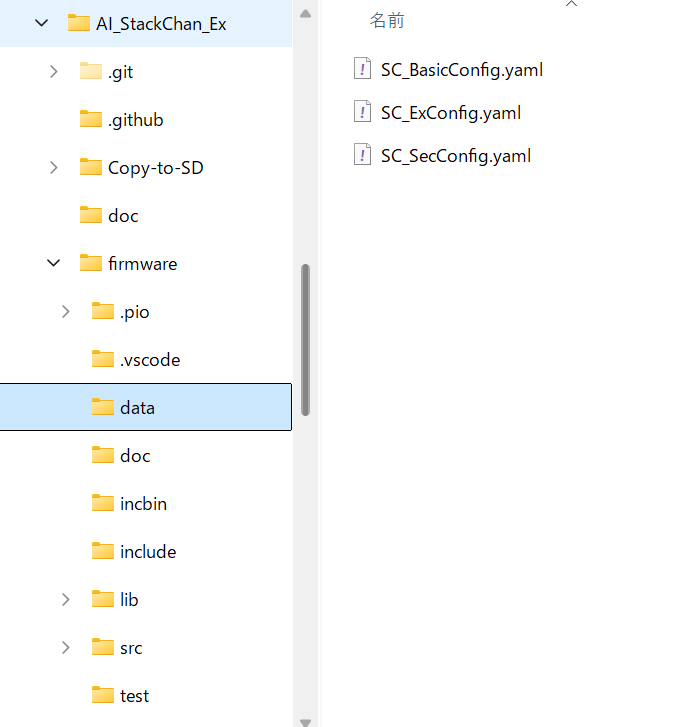
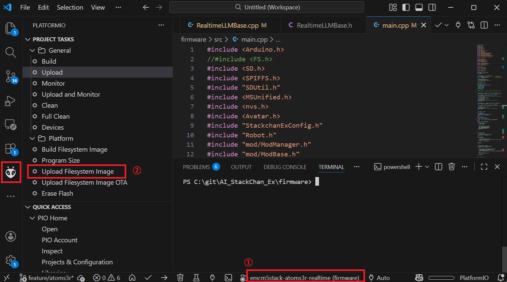

# AtomS3RのSPIFFSにYAMLファイルを書き込む方法

1. 下図のように、AI_StackChan_Ex/firmware/dataに書き込むYAMLファイルを置く。(dataフォルダがない場合は作成する。)

2. PCとAtomS3RをUSBケーブルで接続する。

3. 緑色のLEDが点灯するまでリセットボタンを長押し（約2秒）してから離すことで、AtomS3Rを書き込み待機状態にする。

4. Platformioの画面(下図)で、① envとして「m5stack-atoms3r」または「m5stack-atoms3r-realtime」を選択し、②「Upload Filesystem Image」を実行する。

> Note:  
> WiFi接続できるようになった後は、FTPでSPIFFSのファイルの読み書きができます（ユーザ名：stackchan、パスワード：stackchan）。FFFTP等のフリーソフトで接続できます。
