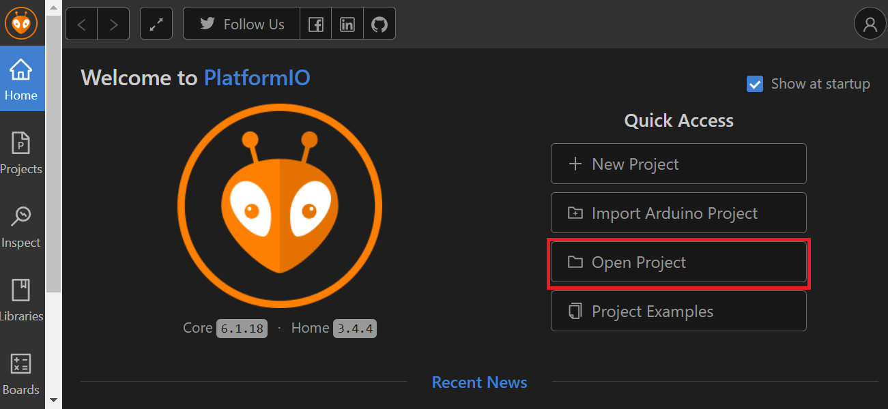
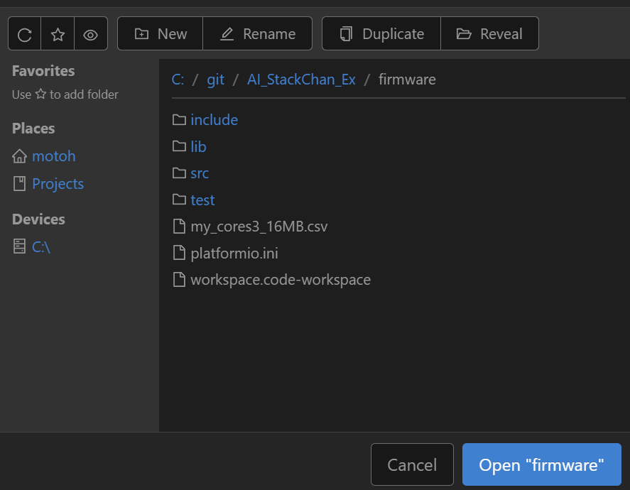
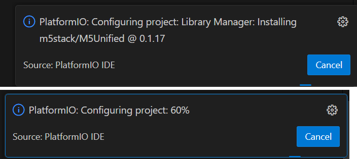
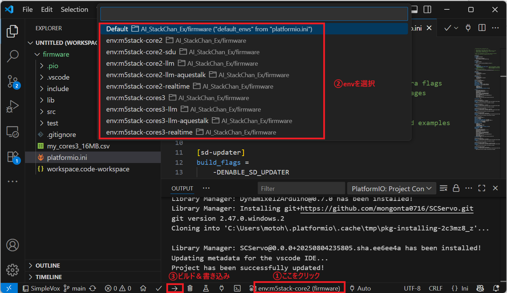
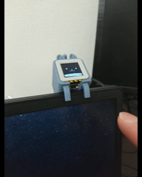
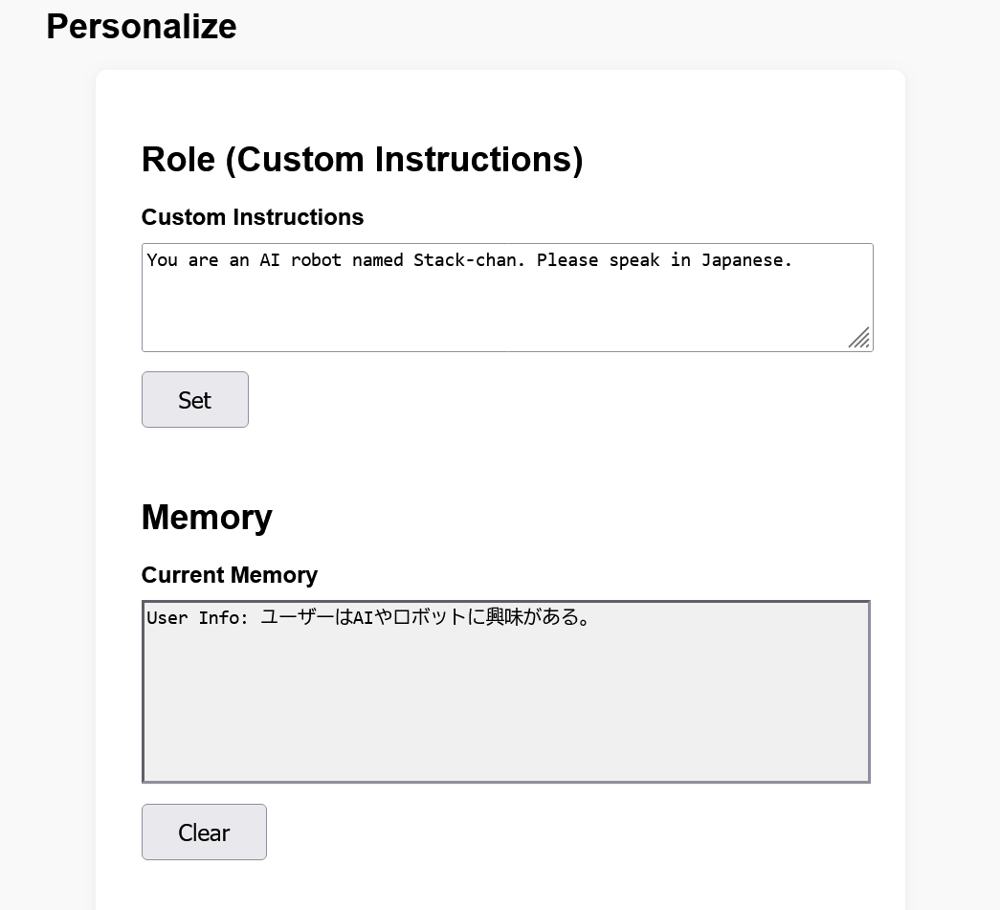
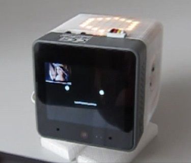

# 基本的な利用方法

robo8080さんの[AIｽﾀｯｸﾁｬﾝ](https://github.com/robo8080/AI_StackChan2)の仕組みを継承した基本的なAI会話機能（LLM、STT、TTSのWeb APIの連携によるAI会話）を利用する方法について解説します。

- [1. 利用可能なAIサービス](#1-利用可能なaiサービス)
  - [1.1. LLM](#11-llm)
  - [1.2. Speech to Text (STT)](#12-speech-to-text-stt)
  - [1.3. Text to Speech (TTS)](#13-text-to-speech-tts)
  - [1.4. Wake Word](#14-wake-word)
  - [1.5. デバイス毎の対応状況](#15-デバイス毎の対応状況)
- [2. 設定、ビルド手順](#2-設定ビルド手順)
  - [2.1. YAMLによる初期設定](#21-yamlによる初期設定)
  - [2.2. ビルド＆書き込み](#22-ビルド書き込み)
- [3. 使い方](#3-使い方)
  - [3.1. 会話](#31-会話)
  - [3.2. パーソナライズ](#32-パーソナライズ)
  - [3.3. カメラによる顔検出（CoreS3のみ）](#33-カメラによる顔検出cores3のみ)

## 1. 利用可能なAIサービス
会話に必要な各種AIサービスの対応状況を示します。  
どのAIサービスを利用するかは、SDカード上のYAMLファイルの設定で選択できます（APIキーは別途取得していただく必要があります）。

### 1.1. LLM
|   |ローカル実行|日本語|英語|備考|
|---|---|---|---|---|
|OpenAI ChatGPT|×|〇|〇|・別途APIキーを取得していただく必要があります<br>・Function Callingに対応[(詳細ページ)](function_calling.md)<br>・MCPに対応[(詳細ページ)](mcp.md)<br>・CoreS3のカメラ画像を入力可能[(詳細ページ)](gpt4o_cores3camera.md)|
|ModuleLLM|〇|〇|〇| [ModuleLLMを使用する際の設定方法](module_llm.md)をご確認ください |
|ModuleLLM (Function Calling対応)|〇|×|〇| [ModuleLLMを使用する際の設定方法](module_llm.md)及び、同ページの付録Bをご確認ください |

### 1.2. Speech to Text (STT)

|   |ローカル実行|日本語|英語|備考|
|---|---|---|---|---|
|Google Cloud STT|×|〇|〇|別途APIキーを取得していただく必要があります |
|OpenAI Whisper|×|〇|〇|別途APIキーを取得していただく必要があります(OpenAI ChatGPTと共通のAPIキーを使用できます)|
|ModuleLLM ASR|〇|×|〇| [ModuleLLMを使用する際の設定方法](module_llm.md)をご確認ください |
|ModuleLLM Whisper|〇|〇|〇| [ModuleLLMを使用する際の設定方法](module_llm.md)及び、同ページの付録Cをご確認ください |

### 1.3. Text to Speech (TTS)

|   |ローカル実行|日本語|英語|備考|
|---|---|---|---|---|
|Web版VoiceVox|×|〇|×|別途APIキーを取得していただく必要があります|
|ElevenLabs|×|〇|〇|別途APIキーを取得していただく必要があります|
|OpenAI TTS|×|〇|〇|別途APIキーを取得していただく必要があります(OpenAI ChatGPTと共通のAPIキーを使用できます)|
|AquesTalk|〇|〇|×|別途ライブラリと辞書データのダウンロードが必要[(詳細ページ)](tts_aquestalk.md)|
|ModuleLLM TTS|〇|〇|〇| [ModuleLLMを使用する際の設定方法](module_llm.md)をご確認ください（日本語化する場合は同ページの付録Cもご確認ください） |

### 1.4. Wake Word

|   |ローカル実行|日本語|英語|備考|
|---|---|---|---|---|
|SimpleVox|×|〇|〇|[詳細ページ](wakeword_simple_vox.md) |
|ModuleLLM KWS|〇|×|〇| ・[ModuleLLMを使用する際の設定方法](module_llm.md)をご確認ください<br> ・"Hi Stack"等、日本語環境でも使いやすいワードにすることは可|

### 1.5. デバイス毎の対応状況

|   |AI Service      |Core2|CoreS3|AtomS3R|
|---|----------------|-----|------|-------|
|LLM|OpenAI ChatGPT  |〇   |〇    |〇     |
|   |ModuleLLM       |〇   |〇    |×     |
|STT|Google Cloud STT|〇   |〇    |〇     |
|   |OpenAI Whisper  |〇   |〇    |〇     |
|   |ModuleLLM       |〇   |〇    |×     |
|TTS|Web版VoiceVox   |〇   |〇    |〇     |
|   |ElevenLabs      |〇   |〇    |〇     |
|   |OpenAI TTS      |〇   |〇    |〇     |
|   |AquesTalk       |〇   |〇    |×     |
|   |ModuleLLM       |〇   |〇    |×     |
|Wake Word|SimpleVox |〇   |〇    |×     |
|   |ModuleLLM       |〇   |〇    |×     |


## 2. 設定、ビルド手順
### 2.1. YAMLによる初期設定
SDカードに保存するYAMLファイルで各種設定を行います。

YAMLファイルは次の3種類があります。
- SC_SecConfig.yaml  
  Wi-Fiパスワード、APIキーの設定。（扱いに注意が必要な情報）
- SC_BasicConfig.yaml  
  サーボに関する設定。
- SC_ExConfig.yaml  
  その他、アプリ固有の設定。

> AtomS3RはSDカード非対応のため、SPIFFSにこれらのファイルを書き込みます。書き込み方法は[こちら](./atoms3r.md)を参照ください。

#### SC_SecConfig.yaml
SDカードフォルダ：/yaml  
ファイル名：SC_SecConfig.yaml

Wi-Fiパスワード、各種AIサービスのAPIキーを設定します。

```yaml
wifi:
  ssid: "********"
  password: "********"

apikey:
  stt: "********"       # ApiKey of SpeechToText Service (OpenAI Whisper/ Google Cloud STT 何れかのキー)
  aiservice: "********" # ApiKey of AIService (OpenAI ChatGPT)
  tts: "********"       # ApiKey of TextToSpeech Service (VoiceVox / ElevenLabs/ OpenAI 何れかのキー)
```


#### SC_BasicConfig.yaml
SDカードフォルダ：/yaml  
ファイル名：SC_BasicConfig.yaml

サーボに関する設定をします。

```yaml
servo: 
  pin: 
    # ServoPin
    # Core2 PortA X:33,Y:32 PortC X:13,Y:14
    # CoreS3 PortA X:2, Y:1 PortB X:9, Y:8 PortC X:17, Y:18
    # When using SCS0009 or Dynamixel XL330, x:RX, y:TX (not used)
    #   RT Version (Dynamixel): x:6 y:7
    #   M5StackChan (SCS0009) : x:7 y:6
    x: 7
    y: 6
  offset: 
    # Specified by +- from 90 degree during servo initialization
    x: 0
    y: 0
  center:
    # サーボの初期位置
    # SG90: x:90 y:90
    # SCS0009: x:150, y:150
    # Dynamixel XL330: x:180, y:270
    # RT Version X:180 Y:5
    # M5StackChan: x:150, y:90
    x: 150
    y: 90
  lower_limit:
    # 可動範囲の下限（下限と言っても取り付け方により逆の場合あり, 値の小さい方を指定。）
    # SG90: x:0, y:60
    # SCS0009: x:0, y:120
    # Dynamixel XL330: x:0, y:220
    # RT Version X:90 Y:-5
    # M5StackChan: x:0 y:0
    x: 0
    y: 0
  upper_limit:
    # 可動範囲の上限（上限と言っても取り付け方により逆の場合もあり, 値の大きい方を指定。）
    # SG90: x:180, y:90
    # SCS0009: x:300, y:150
    # Dynamixel XL330: x:360, y:270
    # Dynamixel RTVersion X:270 Y:15
    # M5StackChan: X:300 y:90
    x: 300 
    y: 90

servo_type: "M5_SCS" # "PWM": SG90PWMServo
                     # "SCS": Feetech SCS0009
                     # "DYN_XL330": Dynamixel XL330
                     # "RT_DYN_XL330": RTVersion 
                     # "M5_SCS": M5StackChan Servo

takao_base: false # Whether to use takaobase to feed power from the rear connector.(Stack-chan_Takao_Base  https://ssci.to/8905)

```

> M5StackChan (M5Stack公式が製品化したｽﾀｯｸﾁｬﾝ)の設定で利用する場合は、stackchan-arduinoライブラリのバージョンがv0.0.7以上であることを確認してください。

> [Stack-chan_Takao_Base](https://ssci.to/8905)のUSBポートから給電する場合は`takao_base`をtrueにしてください。falseでも給電はできますが、バッテリーの充電ができません。なお、`takao_base`をtrueにしたままで、M5StackのUSBポートから給電したりバッテリー駆動させたりする場合はサーボが動きません。

#### SC_ExConfig.yaml
SDカードフォルダ：/app/AiStackChanEx  
ファイル名：SC_ExConfig.yaml

AIサービスの選択や、サービス毎のパラメータを設定します。

```yaml
llm:
  type: 0                            # 0:ChatGPT  1:ModuleLLM

tts:
  type: 0                            # 0:VOICEVOX  1:ElevenLabs  2:OpenAI TTS  3:AquesTalk 4:ModuleLLM

  model: ""                          # VOICEVOX, AquesTalk (modelは未対応)
  #model: "eleven_multilingual_v2"    # ElevenLabs
  #model: "tts-1"                     # OpenAI TTS
  #model: "melotts-ja-jp"             # ModuleLLM (日本語)  ※モデル指定なしの場合は英語

  voice: "3"                         # VOICEVOX (ずんだもん)
  #voice: "AZnzlk1XvdvUeBnXmlld"      # ElevenLabs
  #voice: "alloy"                     # OpenAI TTS
  #voice: ""                          # AquesTalk (voiceは未対応)

stt:
  type: 0                            # 0:Google STT  1:OpenAI Whisper  2:ModuleLLM(ASR)

wakeword:
  type: 0                            # 0:SimpleVox  1:ModuleLLM(KWS)
  keyword: ""                        # SimpleVox (初期設定は不可。ボタンB長押しで登録)
  #keyword: "HI STUCK"                # ModuleLLM(KWS)

# ModuleLLM
moduleLLM:
  # Serial Pin
  # Core2 Rx:13,Tx:14
  # CoreS3 Rx:18,Tx:17
  rxPin: 13
  txPin: 14

```

### 2.2. ビルド＆書き込み
>事前にVSCodeとPlatformIO(VSCodeの拡張機能)、及びUSBドライバのインストールを済ませてください。  
USBドライバは[こちら](https://docs.m5stack.com/en/download)のM5Stackのサイトから入手できます。使用するM5StackがUSBシリアル変換ICをCP210xとCH9102のどちらを実装しているかによって必要なドライバが異なりますが、両方のドライバをインストールしても問題ありません。

①本リポジトリを適当なディレクトリにクローンします。
```
git clone https://github.com/ronron-gh/AI_StackChan_Ex.git
```
>パスが深いと、ライブラリのインクルードパスが通らない場合があります。なるべくCドライブ直下に近い場所でクローンしてください。(例 C:\Git)

②PlatformIOのHome画面でOpen Projectをクリックします。



③クローンしたプロジェクトのfirmwareフォルダ（platformio.iniがあるフォルダ）を選択してOpenをクリックします。



必要なライブラリのインストールが始まり、VSCodeの画面右下にこのような進捗が表示されるので、完了するまで待ちます。



④PCとM5StackをUSBケーブルで接続します。

⑤下図に示す手順でビルド環境(env)を選択し、ビルド＆書き込みを実行します。

>envは、基本はm5stack-xxx (xxxはデバイス名)ですが、例えばOpenAI Realtime APIを使用するときはm5stack-xxx-realtimeを選択します（各機能の解説に従ってください）。envを選択したときに手順③のときと同じようにライブラリのインストールが始まる場合があるので、その場合は完了まで待ってからビルド＆書き込みしてください。




## 3. 使い方
### 3.1. 会話
M5Coreを起動してアバターが表示された後、アバターの額のあたりをタッチすると録音が開始するので話しかけてください。録音時間は約７秒です。

> AtomS3Rは画面自体が物理ボタンになっているため、画面中央を少し強めに押し込んでください。または、次の動画のようにボディーのどこかをダブルタップすることでも録音開始できます（ダブルタップは初期状態は無効になっています。platformio.iniの[env:m5stack-atoms3r]セクション内の-DENABLE_TAP_DETECTのコメントアウトを解除してビルドすることで有効化できます）。
> 


### 3.2. パーソナライズ
カスタム指示（いわゆるロール）、及びメモリー（長期記憶）により、AI会話機能をユーザーの属性に合わせてカスタマイズすることができます。

PCやスマートフォンのWebブラウザで http://(ｽﾀｯｸﾁｬﾝのIPアドレス) にアクセスすると次のような設定画面が開きます。（IPアドレスは起動時の画面に表示されます。また、Core2/CoreS3はCボタンまたはLCD右端をタッチするとアクセス用のQRコードが表示されます。）




**〇 メモリー（長期記憶）について**  
メモリーを有効にするには SDカードの/app/AiStackChanEx/SC_ExConfig.yaml で enableMemory を true に設定してください。

> 現在、メモリーに対応しているLLMは、ChatGPT（Realtime API含む）、Gemini Liveです。

SC_ExConfig.yaml
```yaml
llm:
  type: 0               # 0:ChatGPT  1:ModuleLLM  2:ModuleLLM(Function Calling)  3:Gemini
  enableMemory: true    # true でメモリー有効（デフォルトはfalse）
```

メモリーを有効にすると、会話の中でユーザーの属性（趣味や仕事など）や印象的なエピソードがあれば要約してSPIFFSに保存されます。電源をOFFにしてもSPIFFSの内容は保持され、次回起動時に記憶情報として読み出されます。

> 記憶するかどうかはLLMが会話中に判断するため、ユーザーの期待通りに記憶されない場合があります（「今の会話内容をメモリーに保存して」と明示的に指示することも可能です）。また、一度記憶した情報も、要約を繰り返す過程で失われる可能性があります。


### 3.3. カメラによる顔検出（CoreS3のみ）


- 顔を検出すると音声認識を起動します。
  - LCD中央左側をタッチするとサイレントモードになり、顔検出しても起動しません。（代わりに、顔検出している間ｽﾀｯｸﾁｬﾝが笑顔になります。）
- LCDの左上隅にカメラ画像が表示されます。画像部分をタッチすると表示ON/OFFできます。

※顔検出は初期状態ではplatformio.iniで以下のようにコメントアウトし無効化しています。有効化する際はDENABLE_CAMERAとDENABLE_FACE_DETECTを有効化してください。
```
build_flags=
  -DBOARD_HAS_PSRAM
  -DARDUINO_M5STACK_CORES3
  ;-DENABLE_CAMERA
  ;-DENABLE_FACE_DETECT
  -DENABLE_WAKEWORD
```
