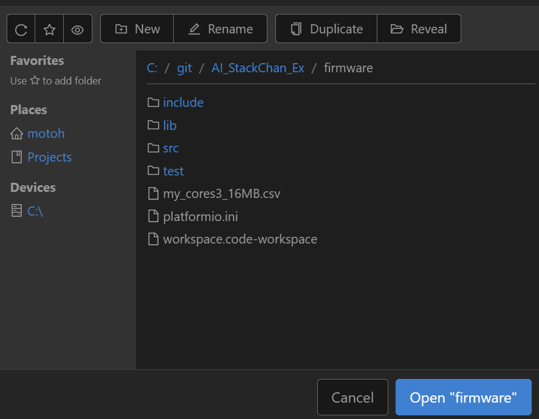

# 基本的な利用方法

robo8080さんの[AIｽﾀｯｸﾁｬﾝ](https://github.com/robo8080/AI_StackChan2)の仕組みを継承した基本的なAI会話機能（LLM、STT、TTSのWeb APIの連携によるAI会話）を利用する方法について解説します。

- [1. 利用可能なAIサービス](#1-利用可能なaiサービス)
  - [1.1. LLM](#11-llm)
  - [1.2. Speech to Text (STT)](#12-speech-to-text-stt)
  - [1.3. Text to Speech (TTS)](#13-text-to-speech-tts)
  - [1.4. Wake Word](#14-wake-word)
- [2. 設定、ビルド手順](#2-設定ビルド手順)
  - [2.1. YAMLによる初期設定](#21-yamlによる初期設定)
  - [2.2. ビルド＆書き込み](#22-ビルド書き込み)

## 1. 利用可能なAIサービス
会話に必要な各種AIサービスの対応状況を示します。  
どのAIサービスを利用するかは、SDカード上のYAMLファイルの設定で選択できます（APIキーは別途取得していただく必要があります）。

### 1.1. LLM
|   |ローカル実行|日本語|英語|備考|
|---|---|---|---|---|
|OpenAI ChatGPT|×|〇|〇|・別途APIキーを取得していただく必要があります<br>・Function Callingに対応[(詳細ページ)](function_calling.md)<br>・MCPに対応[(詳細ページ)](mcp.md)<br>・CoreS3のカメラ画像を入力可能[(詳細ページ)](gpt4o_cores3camera.md)|
|ModuleLLM|〇|〇|〇| [ModuleLLMを使用する際の設定方法](module_llm.md)をご確認ください |
|ModuleLLM (Function Calling対応)|〇|×|〇| [ModuleLLMを使用する際の設定方法](module_llm.md)及び、同ページの付録Bをご確認ください |

### 1.2. Speech to Text (STT)

|   |ローカル実行|日本語|英語|備考|
|---|---|---|---|---|
|Google Cloud STT|×|〇|〇|別途APIキーを取得していただく必要があります |
|OpenAI Whisper|×|〇|〇|別途APIキーを取得していただく必要があります(OpenAI ChatGPTと共通のAPIキーを使用できます)|
|ModuleLLM ASR|〇|×|〇| [ModuleLLMを使用する際の設定方法](module_llm.md)をご確認ください |
|ModuleLLM Whisper|〇|〇|〇| [ModuleLLMを使用する際の設定方法](module_llm.md)及び、同ページの付録Cをご確認ください |

### 1.3. Text to Speech (TTS)

|   |ローカル実行|日本語|英語|備考|
|---|---|---|---|---|
|Web版VoiceVox|×|〇|×|別途APIキーを取得していただく必要があります|
|ElevenLabs|×|〇|〇|別途APIキーを取得していただく必要があります|
|OpenAI TTS|×|〇|〇|別途APIキーを取得していただく必要があります(OpenAI ChatGPTと共通のAPIキーを使用できます)|
|AquesTalk|〇|〇|×|別途ライブラリと辞書データのダウンロードが必要[(詳細ページ)](tts_aquestalk.md)|
|ModuleLLM TTS|〇|〇🆕|〇| [ModuleLLMを使用する際の設定方法](module_llm.md)をご確認ください（日本語化する場合は同ページの付録Cもご確認ください） |

### 1.4. Wake Word

|   |ローカル実行|日本語|英語|備考|
|---|---|---|---|---|
|SimpleVox|×|〇|〇|[詳細ページ](wakeword_simple_vox.md) |
|ModuleLLM KWS|〇|×|〇| ・[ModuleLLMを使用する際の設定方法](module_llm.md)をご確認ください<br> ・"Hi Stack"等、日本語環境でも使いやすいワードにすることは可|


## 2. 設定、ビルド手順
### 2.1. YAMLによる初期設定
SDカードに保存するYAMLファイルで各種設定を行います。

YAMLファイルは次の3種類があります。
- SC_SecConfig.yaml  
  Wi-Fiパスワード、APIキーの設定。（扱いに注意が必要な情報）
- SC_BasicConfig.yaml  
  サーボに関する設定。
- SC_ExConfig.yaml  
  その他、アプリ固有の設定。

#### 2.1. SC_SecConfig.yaml
SDカードフォルダ：/yaml  
ファイル名：SC_SecConfig.yaml

Wi-Fiパスワード、各種AIサービスのAPIキーを設定します。

```
wifi:
  ssid: "********"
  password: "********"

apikey:
  stt: "********"       # ApiKey of SpeechToText Service (OpenAI Whisper/ Google Cloud STT 何れかのキー)
  aiservice: "********" # ApiKey of AIService (OpenAI ChatGPT)
  tts: "********"       # ApiKey of TextToSpeech Service (VoiceVox / ElevenLabs/ OpenAI 何れかのキー)
```


#### 2.2. SC_BasicConfig.yaml
SDカードフォルダ：/yaml  
ファイル名：SC_BasicConfig.yaml

サーボに関する設定をします。

```
servo: 
  pin: 
    # ServoPin
    # Core1 PortA X:22,Y:21 PortC X:16,Y:17
    # Core2 PortA X:33,Y:32 PortC X:13,Y:14
    # CoreS3 PortA X:1,Y:2 PortB X:8,Y:9 PortC X:18,Y:17
    # Stack-chanPCB Core1 X:5,Y:2 Core2 X:19,Y27
    # When using SCS0009, x:RX, y:TX (not used).(StackchanRT Version:Core1 x16,y17, Core2: x13,y14)
    x: 33
    y: 32
  center:
    # SG90 X:90, Y:90
    # SCS0009 X:150, Y:150
    # Dynamixel X:180, Y:270
    x: 90
    y: 90
  offset: 
    # Specified by +- from 90 degree during servo initialization
    x: 0
    y: 0

servo_type: "PWM" # "PWM": SG90PWMServo, "SCS": Feetech SCS0009
```

> SC_BasicConfig.yamlには他にも様々な基本設定が記述されていますが、現状、本ソフトが対応しているのは上記の設定のみです。


#### 2.3. SC_ExConfig.yaml
SDカードフォルダ：/app/AiStackChanEx  
ファイル名：SC_ExConfig.yaml

AIサービスの選択や、サービス毎のパラメータを設定します。

```
llm:
  type: 0                            # 0:ChatGPT  1:ModuleLLM

tts:
  type: 0                            # 0:VOICEVOX  1:ElevenLabs  2:OpenAI TTS  3:AquesTalk 4:ModuleLLM

  model: ""                          # VOICEVOX, AquesTalk (modelは未対応)
  #model: "eleven_multilingual_v2"    # ElevenLabs
  #model: "tts-1"                     # OpenAI TTS
  #model: "melotts-ja-jp"             # ModuleLLM (日本語)  ※モデル指定なしの場合は英語

  voice: "3"                         # VOICEVOX (ずんだもん)
  #voice: "AZnzlk1XvdvUeBnXmlld"      # ElevenLabs
  #voice: "alloy"                     # OpenAI TTS
  #voice: ""                          # AquesTalk (voiceは未対応)

stt:
  type: 0                            # 0:Google STT  1:OpenAI Whisper  2:ModuleLLM(ASR)

wakeword:
  type: 0                            # 0:SimpleVox  1:ModuleLLM(KWS)
  keyword: ""                        # SimpleVox (初期設定は不可。ボタンB長押しで登録)
  #keyword: "HI STUCK"                # ModuleLLM(KWS)

# ModuleLLM
moduleLLM:
  # Serial Pin
  # Core2 Rx:13,Tx:14
  # CoreS3 Rx:18,Tx:17
  rxPin: 13
  txPin: 14

```

### 2.2. ビルド＆書き込み
>事前にVSCodeとPlatformIO(VSCodeの拡張機能)、及びUSBドライバのインストールを済ませてください。  
USBドライバは[こちら](https://docs.m5stack.com/en/download)のM5Stackのサイトから入手できます。使用するM5StackがUSBシリアル変換ICをCP210xとCH9102のどちらを実装しているかによって必要なドライバが異なりますが、両方のドライバをインストールしても問題ありません。

①本リポジトリを適当なディレクトリにクローンします。
```
git clone https://github.com/ronron-gh/AI_StackChan_Ex.git
```
>パスが深いと、ライブラリのインクルードパスが通らない場合があります。なるべくCドライブ直下に近い場所でクローンしてください。(例 C:\Git)

②PlatformIOのHome画面でOpen Projectをクリックします。


③クローンしたプロジェクトのfirmwareフォルダ（platformio.iniがあるフォルダ）を選択してOpenをクリックします。



必要なライブラリのインストールが始まり、VSCodeの画面右下にこのような進捗が表示されるので、完了するまで待ちます。


④PCとM5StackをUSBケーブルで接続します。

⑤下図に示す手順でビルド環境(env)を選択し、ビルド＆書き込みを実行します。

>envは、基本はm5stack-core2(s3)ですが、例えばOpenAI Realtime APIを使用するときはm5stack-core2(s3)-realtimeを選択します（各機能の解説に従ってください）。envを選択したときに手順③のときと同じようにライブラリのインストールが始まる場合があるので、その場合は完了まで待ってからビルド＆書き込みしてください。


