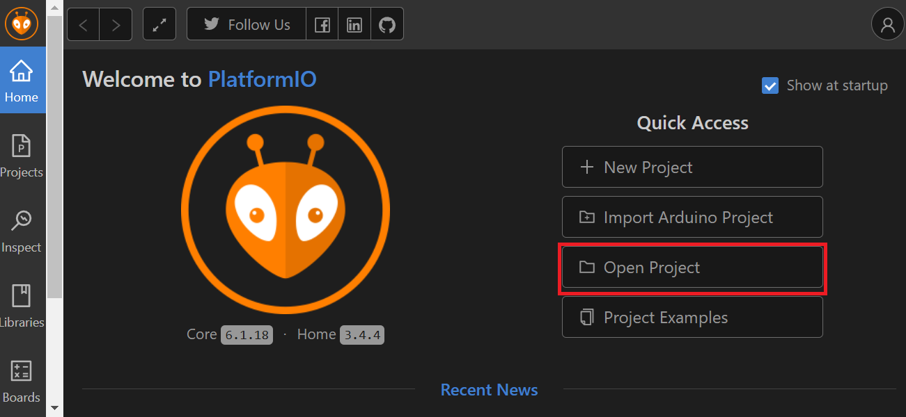
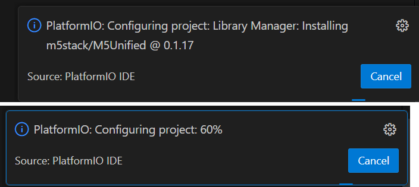
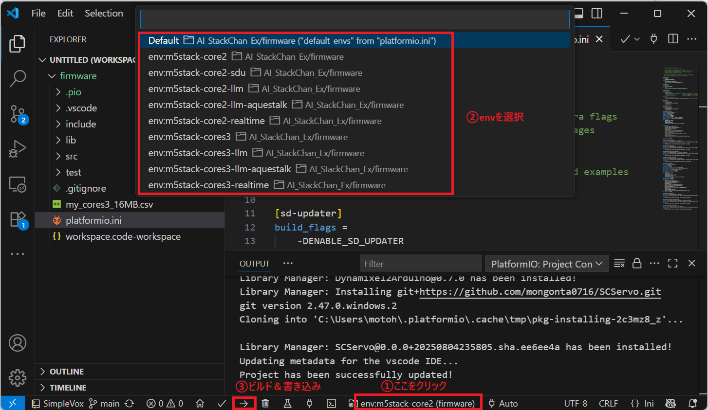

# Basic usage

This article explains how to use the basic AI conversation function (AI conversation through the integration of LLM, STT, and TTS Web APIs) that inherits the mechanism of robo8080's [AI Stack-chan](https://github.com/robo8080/AI_StackChan2).

- [1. Available AI services](#1-available-ai-services)
  - [1.1. LLM](#11-llm)
  - [1.2. Speech to Text (STT)](#12-speech-to-text-stt)
  - [1.3. Text to Speech (TTS)](#13-text-to-speech-tts)
  - [1.4. Wake Word](#14-wake-word)
- [2. Settings and build](#2-settings-and-build)
  - [2.1. Initial setup with YAML](#21-initial-setup-with-yaml)
  - [2.2. Build \& Flash](#22-build--flash)

## 1. Available AI services
This shows the support status of various AI services required for conversation.  
You can select which AI service to use by configuring the YAML file on the SD card (you will need to obtain an API key separately).

### 1.1. LLM
|   |Local execution|Japanese|English|Remarks|
|---|---|---|---|---|
|OpenAI ChatGPT|×|〇|〇|・You need to get an API key<br>・Supports Function Calling. [Details page](function_calling_en.md)<br>・Supports MCP. [Details page](mcp_en.md)<br>・CoreS3 camera images can be input. [Details page](gpt4o_cores3camera_en.md)|
|ModuleLLM|〇|〇|〇| Please check [How to set up ModuleLLM](module_llm_en.md). <br>Function calling is also supported (see [Appendix B on the same page](module_llm_en.md#appendix-a-how-to-implement-function-calling)).|

### 1.2. Speech to Text (STT)

|   |Local execution|Japanese|English|Remarks|
|---|---|---|---|---|
|Google Cloud STT|×|〇|〇| You need to get an API key|
|OpenAI Whisper|×|〇|〇| You need to get an API key (You can use a common API key with OpenAI ChatGPT)|
|ModuleLLM ASR|〇|×|〇| Please check [How to set up ModuleLLM](module_llm_en.md) |

### 1.3. Text to Speech (TTS)

|   |Local execution|Japanese|English|Remarks|
|---|---|---|---|---|
|Web版VoiceVox|×|〇|×| You need to get an API key|
|ElevenLabs|×|〇|〇| You need to get an API key|
|OpenAI TTS|×|〇|〇| You need to get an API key (You can use a common API key with OpenAI ChatGPT)|
|AquesTalk|〇|〇|×|Library and dictionary data must be downloaded separately.[Details page](tts_aquestalk.md)|
|ModuleLLM TTS|〇|×|〇| Please check [How to set up ModuleLLM](module_llm_en.md) |

### 1.4. Wake Word

|   |Local execution|Japanese|English|Remarks|
|---|---|---|---|---|
|SimpleVox|×|〇|〇|[Details page](wakeword_simple_vox_en.md) |
|ModuleLLM KWS|〇|×|〇| ・Please check [How to set up ModuleLLM](module_llm_en.md)|

## 2. Settings and build
### 2.1. Initial setup with YAML
Various settings are made using the YAML file saved on the SD card.

There are three types of YAML files:
- SC_SecConfig.yaml  
  Wi-Fi password, API key settings. (Sensitive information)
- SC_BasicConfig.yaml  
  Servo related settings.
- SC_ExConfig.yaml  
  Other app-specific settings.

#### SC_SecConfig.yaml
SD card folder：/yaml  
File name：SC_SecConfig.yaml

Set the Wi-Fi password and API keys for various AI services.

```
wifi:
  ssid: "********"
  password: "********"

apikey:
  stt: "********"       # ApiKey of SpeechToText Service (OpenAI Whisper/ Google Cloud STT )
  aiservice: "********" # ApiKey of AIService (OpenAI ChatGPT)
  tts: "********"       # ApiKey of TextToSpeech Service (VoiceVox / ElevenLabs/ OpenAI )
```


#### SC_BasicConfig.yaml
SD card folder：/yaml  
File name：SC_BasicConfig.yaml

Configure the servo settings.

```
servo: 
  pin: 
    # ServoPin
    # Core1 PortA X:22,Y:21 PortC X:16,Y:17
    # Core2 PortA X:33,Y:32 PortC X:13,Y:14
    # CoreS3 PortA X:1,Y:2 PortB X:8,Y:9 PortC X:18,Y:17
    # Stack-chanPCB Core1 X:5,Y:2 Core2 X:19,Y27
    # When using SCS0009, x:RX, y:TX (not used).(StackchanRT Version:Core1 x16,y17, Core2: x13,y14)
    x: 33
    y: 32
  center:
    # SG90 X:90, Y:90
    # SCS0009 X:150, Y:150
    # Dynamixel X:180, Y:270
    x: 90
    y: 90
  offset: 
    # Specified by +- from 90 degree during servo initialization
    x: 0
    y: 0

servo_type: "PWM" # "PWM": SG90PWMServo, "SCS": Feetech SCS0009
```

> SC_BasicConfig.yaml contains various other basic settings, but currently this software only supports the settings listed above.


#### SC_ExConfig.yaml
SD card folder：/app/AiStackChanEx  
File name：SC_ExConfig.yaml

Select an AI service and set parameters for each service.

```
llm:
  type: 0                            # 0:ChatGPT  1:ModuleLLM

tts:
  type: 0                            # 0:VOICEVOX  1:ElevenLabs  2:OpenAI TTS  3:AquesTalk 4:ModuleLLM

  model: ""                          # VOICEVOX (model is not supported)
  #model: "eleven_multilingual_v2"    # ElevenLabs
  #model: "tts-1"                     # OpenAI TTS
  #model: ""                          # AquesTalk (model is not supported)

  voice: "3"                         # VOICEVOX (Zundamon)
  #voice: "AZnzlk1XvdvUeBnXmlld"      # ElevenLabs
  #voice: "alloy"                     # OpenAI TTS
  #voice: ""                          # AquesTalk (model is not supported)

stt:
  type: 0                            # 0:Google STT  1:OpenAI Whisper  2:ModuleLLM(ASR)

wakeword:
  type: 0                            # 0:SimpleVox  1:ModuleLLM(KWS)
  keyword: ""                        # SimpleVox (Initial setting is not possible. Press and hold Button B to register.)
  #keyword: "HI STUCK"                # ModuleLLM(KWS)

# ModuleLLM
moduleLLM:
  # Serial Pin
  # Core2 Rx:13,Tx:14
  # CoreS3 Rx:18,Tx:17
  rxPin: 13
  txPin: 14

```


### 2.2. Build & Flash

> Please make sure to install VSCode, the PlatformIO extension for VSCode, and the necessary USB drivers in advance.  
You can download the USB drivers from the [M5Stack website](https://docs.m5stack.com/en/download). The required driver depends on whether your M5Stack uses the CP210x or CH9102 USB-serial conversion IC, but installing both drivers is not a problem.

1. Clone this repository into an appropriate directory.
```
git clone https://github.com/ronron-gh/AI_StackChan_Ex.git
```
> If the path is too deep, the library include path may not work. Please clone as close to the root of the C drive as possible (e.g., C:\Git).

2. In the PlatformIO Home screen, click "Open Project".



3. Select the firmware folder (the folder containing platformio.ini) of the cloned project and click "Open".


The required libraries will start installing, and you will see progress at the bottom right of the VSCode window. Please wait until it completes.



4. Connect your PC and M5Stack with a USB cable.

5. Follow the steps shown below to select the build environment (env), then build and flash the firmware.

> The default env is m5stack-core2(s3), but for example, if you want to use the OpenAI Realtime API, select m5stack-core2(s3)-realtime (see the explanation for each feature). When you select an env, library installation may start again as in step 3, so please wait for it to complete before building and flashing.


