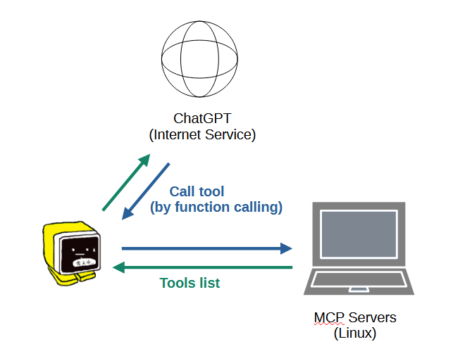

# MCP

- [概要](#概要)
- [YAMLの設定方法](#yamlの設定方法)
- [各種MCPサーバの導入方法](#各種mcpサーバの導入方法)
  - [Web検索（Brave Search）](#web検索brave-search)
  - [長期記憶 (server-memory)](#長期記憶-server-memory)
  - [Googleカレンダー](#googleカレンダー)

## 概要
下図のように外部のPC（Linux）で起動したMCPサーバをChatGPTのFunction Callingを介して使用することができます。M5Stack側はSDカード上のYAMLファイルで各MCPサーバのURLを設定するだけで、起動時に自動的に各MCPサーバからTool listを取得してFunction Callingのプロンプトに登録されます。



## YAMLの設定方法
SDカードフォルダ：/app/AiStackChanEx  
ファイル名：SC_ExConfig.yaml

下記のように、llmセクションにmcpServersのリストを追記し、各MCPサーバのURLとPortを設定します。名前("name")は任意の名前で問題ありません。

```yaml
llm:
  type: 0            # 0:ChatGPT  1:ModuleLLM  2:ModuleLLM(Function Calling)

  mcpServers:
    [
      {
        "name":"brave-search",
        "url":"192.168.xxx.xxx",
        "port":8000
      },
      {
        "name":"server-memory",
        "url":"192.168.xxx.xxx",
        "port":8001
      },
      {
        "name":"google-calendar",
        "url":"192.168.xxx.xxx",
        "port":8002
      }
    ]
```

## 各種MCPサーバの導入方法
現在以下のMCPサーバについて動作を確認済みです。それぞれのMCPサーバの導入方法について以降で解説します。

- Web検索（Brave Search）
- 長期記憶（server-memory）
- Googleカレンダー（自作）

> これらに限らず、基本的にはトランスポートの方式がSSE（Server-Sent Events）に対応したMCPサーバであれば利用することができます。また、SSEに対応していないMCPサーバも、Supergatewayというツールを利用することでSSEに対応させることができます。以降の例でもSupergatewayを利用しています。

### Web検索（Brave Search）
UbuntuをインストールしたPCでBrave Searchを動かす手順を解説します。予めNode.jsもインストールしてください。
動作を確認したバージョンは次の通りです（最低要件ということではありません）。MCPサーバの負荷は高くないので、低スペックなPCで問題ありません。Raspberry Pi等のSBCでも動くと思います（動作は未確認）。
- Ubuntu: 20.04
- Node.js: 22.15.0

① Brave SearchのAPIキーを取得  
[公式サイト](https://brave.com/ja/search/api/)でAPIキーを取得します。無料プランもあります。

② UbuntuにSupergatewayとBrave Searchをインストール  
```
npm install -g supergateway @modelcontextprotocol/server-brave-search
```

③ 環境変数にAPIキーを設定  
```
export BRAVE_API_KEY=************
```

④ Supergateway経由でBrave Searchを起動  
```
npx -y supergateway --stdio "npx -y @modelcontextprotocol/server-brave-search" --port 8000
```

> 参考サイト：  
> [『Supergateway 完全ガイド：stdio専用MCPサーバーをSSE/WebSocket化してLLM連携を自由自在に』](https://notai.jp/supergateway/)  
> Brave SearchをSupergateway経由で起動する方法はこちらのサイトを参考にさせていただきました。
> こちらのサイトではDockerを使って構築する方法で解説されていますので、Dockerを使いたい方はぜひこちらのサイトを参考にしてください。

### 長期記憶 (server-memory)
① インストール＆起動  
こちらも上記Brave Searchと同じ環境で、Supergatewayで起動します。

追加でserver-memoryをインストールしてください。
```
npm install -g @modelcontextprotocol/server-memory
```
Brave Searchと同じように、次のコマンドで起動できます。
```
npx -y supergateway --stdio "npx -y @modelcontextprotocol/server-memory" --port 8001
```

② ロールの設定  
ChatGPTにserver-memoryを使いこなしてもらうために、以下のようなロール設定をプロンプトに挿入する必要があります。これはM5Stack側で設定します。

```
You are a helpful assistant.
Please speak in Japanese.
Follow these steps for each interaction:
1. User Identification:
   - You should assume that you are interacting with default_user
   - If you have not identified default_user, proactively try to do so.
2. Memory Retrieval:
   - Retrieve all relevant information from your knowledge graph
   - Always refer to your knowledge graph as your "memory"
3. Memory
   - While conversing with the user, be attentive to any new information that falls into these categories:
     a) Basic Identity (age, gender, location, job title, education level, etc.)
     b) Behaviors (interests, habits, etc.)
     c) Preferences (communication style, preferred language, etc.)
     d) Goals (goals, targets, aspirations, etc.)
     e) Relationships (personal and professional relationships up to 3 degrees of separation)
4. Memory Update:
   - If any new information was gathered during the interaction, update your memory as follows:
     a) Create entities for recurring organizations, people, and significant events
     b) Connect them to the current entities using relations
     b) Store facts about them as observations

```

M5Stackへのロール設定はWebブラウザアプリでできます。Webブラウザのアドレスバーに以下のURLを入力してアクセスすると、ロール設定用のGUIが表示されますので、上記の内容をそのままコピー＆ペーストして設定してください。
```
192.168.xxx.xxx/role    (192.168.xxx.xxxはM5StackのIPアドレス)
```


### Googleカレンダー
準備中🙇‍♂️
