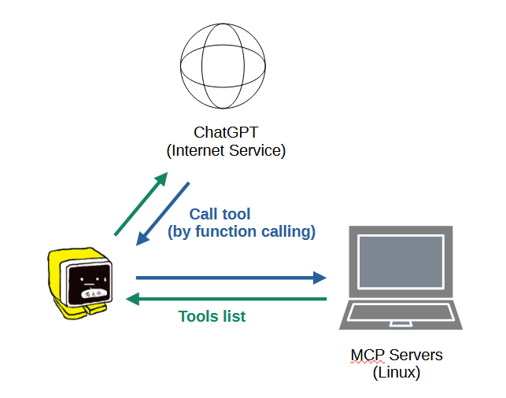
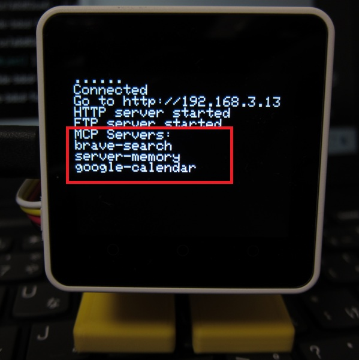
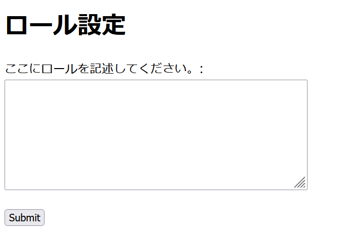

# MCP

- [Overview](#overview)
- [How to set YAML](#how-to-set-yaml)
- [How to install each MCP server](#how-to-install-each-mcp-server)
  - [Web search（Brave Search）](#web-searchbrave-search)
  - [Long term memory (server-memory)](#long-term-memory-server-memory)
  - [Google calendar](#google-calendar)

## Overview
As shown in the figure below, you can use an MCP server running on an external PC (Linux) via ChatGPT's Function Calling. On the M5Stack side, you just need to set the URL of each MCP server in the YAML file on the SD card, and the tool list will be automatically obtained from each MCP server at startup and registered in the Function Calling prompt.



## How to set YAML
SD card folder：/app/AiStackChanEx  
File name：SC_ExConfig.yaml

Add a list of mcpServers to the llm section as shown below, and set the URL and Port of each MCP server. The name ("name") can be any name.

```yaml
llm:
  type: 0            # 0:ChatGPT  1:ModuleLLM  2:ModuleLLM(Function Calling)

  mcpServers:
    [
      {
        "name":"brave-search",
        "url":"192.168.xxx.xxx",
        "port":8000
      },
      {
        "name":"server-memory",
        "url":"192.168.xxx.xxx",
        "port":8001
      },
      {
        "name":"google-calendar",
        "url":"192.168.xxx.xxx",
        "port":8002
      }
    ]
```

If the settings are correct, the name of the MCP server to which you have successfully connected will be displayed on the startup screen.



## How to install each MCP server
Currently, the following MCP servers have been confirmed to work. The installation method for each MCP server is explained below.

- Web search（Brave Search）
- Long term memory（server-memory）
- Google calendar（self-made）

> However, any MCP server that supports the transport method SSE (Server-Sent Events) can be used. Also, MCP servers that do not support SSE can be made to support SSE by using a tool called Supergateway. The following examples also use Supergateway.

### Web search（Brave Search）
This section explains how to run Brave Search on a PC with Ubuntu installed. Please also install Node.js beforehand.
The following versions have been confirmed to work (these are not the minimum requirements). The load on the MCP server is not high, so there are no problems with low-spec PCs.

Test environment：
- Ubuntu: 20.04
- Node.js: 22.15.0

① Get your Brave Search API key  
Get an API key from the [official website](https://brave.com/ja/search/api/). There is also a free plan.

② Install Supergateway and Brave Search on Ubuntu  
```
npm install -g supergateway @modelcontextprotocol/server-brave-search
```

③ Set the API key in the environment variables  
```
export BRAVE_API_KEY=************
```

④ Launch Brave Search via Supergateway 
```
npx -y supergateway --stdio "npx -y @modelcontextprotocol/server-brave-search" --port 8000
```

> Reference site：  
> [『Supergateway 完全ガイド：stdio専用MCPサーバーをSSE/WebSocket化してLLM連携を自由自在に』](https://notai.jp/supergateway/)  
> I used this site as a reference for how to launch Brave Search via Supergateway.
> This site explains how to build it using Docker, so if you want to use Docker, please refer to this site.

### Long term memory (server-memory)
Test environment：
- Ubuntu: 20.04
- Node.js: 22.15.0

① Installation and Startup 
This is also launched via the Supergateway in the same way as Brave Search above.

Install Supergateway and server-memory on Ubuntu.
```
npm install -g supergateway @modelcontextprotocol/server-memory
```
Just like Brave Search, you can launch it with the following command:
```
npx -y supergateway --stdio "npx -y @modelcontextprotocol/server-memory" --port 8001
```

② Set Role  
In order for ChatGPT to use server-memory, you need to insert the following role setting into the prompt. This is set on the M5Stack side.

```
You are a helpful assistant.
Please speak in Japanese.
Follow these steps for each interaction:
1. User Identification:
   - You should assume that you are interacting with default_user
   - If you have not identified default_user, proactively try to do so.
2. Memory Retrieval:
   - Retrieve all relevant information from your knowledge graph
   - Always refer to your knowledge graph as your "memory"
3. Memory
   - While conversing with the user, be attentive to any new information that falls into these categories:
     a) Basic Identity (age, gender, location, job title, education level, etc.)
     b) Behaviors (interests, habits, etc.)
     c) Preferences (communication style, preferred language, etc.)
     d) Goals (goals, targets, aspirations, etc.)
     e) Relationships (personal and professional relationships up to 3 degrees of separation)
4. Memory Update:
   - If any new information was gathered during the interaction, update your memory as follows:
     a) Create entities for recurring organizations, people, and significant events
     b) Connect them to the current entities using relations
     b) Store facts about them as observations

```

You can set the role for M5Stack using a web browser app. Enter the following URL in the address bar of your web browser and access it. The GUI for role setting will be displayed, so copy and paste the above content as is and set it.
```
192.168.xxx.xxx/role    (192.168.xxx.xxx is the IP address of the M5Stack)
```



### Google calendar
Test environment：
- Ubuntu: 20.04

I forked the "Google Calendar MCP Server" from [this repository](https://github.com/101ta28/google-calendar-mcp-server), changed the transport specification from Stdio to SSE, and customized it to simplify functions. Specify the branch (change_to_sse) as follows to clone, and start the MCP server by following [README](https://github.com/ronron-gh/google-calendar-mcp-server/blob/change_to_sse/README.md).

```
git clone -b change_to_sse https://github.com/ronron-gh/google-calendar-mcp-server.git
```
