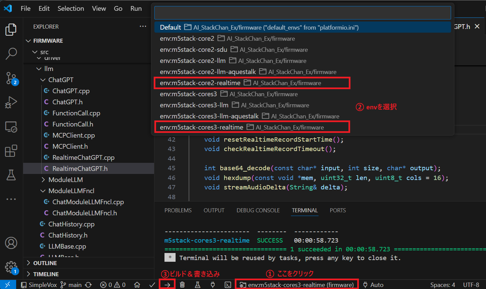

# Realtime API

- [概要](#概要)
- [設定方法](#設定方法)
  - [YAMLの設定① (Wi-Fi、APIキー)](#yamlの設定-wi-fiapiキー)
  - [YAMLの設定② (サーボ)](#yamlの設定-サーボ)
  - [ビルド＆書き込み](#ビルド書き込み)
- [使い方](#使い方)
  - [リアルタイム会話](#リアルタイム会話)
  - [サーボ動作の停止、再開](#サーボ動作の停止再開)
- [Function Calling及びMCP](#function-calling及びmcp)

## 概要
OpenAIのRealtime APIを利用することで、従来よりもリアルタイムに近い応答速度で会話を楽しむことができます。  
M5Core2及びCoreS3(SE)に対応しています。

## 設定方法
Realtime APIを有効にするために次の設定を行います。

・YAMLファイル（2種類）を作成しSDカードに保存  
・ビルド＆書き込み

### YAMLの設定① (Wi-Fi、APIキー)
SDカードフォルダ：/yaml  
ファイル名：SC_SecConfig.yaml

Wi-FiパスワードとOpen AIのAPIキー(aiservice)を設定します。STTとTTSは使用しないため設定不要です。

```
wifi:
  ssid: "********"
  password: "********"

apikey:
  stt: "********"       # ApiKey of SpeechToText Service (OpenAI Whisper/ Google Cloud STT 何れかのキー)
  aiservice: "********" # ApiKey of AIService (OpenAI ChatGPT)
  tts: "********"       # ApiKey of TextToSpeech Service (VoiceVox / ElevenLabs/ OpenAI 何れかのキー)
```

### YAMLの設定② (サーボ)
SDカードフォルダ：/yaml  
ファイル名：SC_BasicConfig.yaml

サーボの種類、ポート等を設定をします。サーボを使わない場合は省略して問題ありません。

```
servo: 
  pin: 
    # ServoPin
    # Core1 PortA X:22,Y:21 PortC X:16,Y:17
    # Core2 PortA X:33,Y:32 PortC X:13,Y:14
    # CoreS3 PortA X:1,Y:2 PortB X:8,Y:9 PortC X:18,Y:17
    # Stack-chanPCB Core1 X:5,Y:2 Core2 X:19,Y27
    # When using SCS0009, x:RX, y:TX (not used).(StackchanRT Version:Core1 x16,y17, Core2: x13,y14)
    x: 33
    y: 32
  center:
    # SG90 X:90, Y:90
    # SCS0009 X:150, Y:150
    # Dynamixel X:180, Y:270
    x: 90
    y: 90
  offset: 
    # Specified by +- from 90 degree during servo initialization
    x: 0
    y: 0

servo_type: "PWM" # "PWM": SG90PWMServo, "SCS": Feetech SCS0009
```


### ビルド＆書き込み
下図のように、VSCode(Platformio)のGUIで"env:m5stack-core2(s3)-realtime"を選択してビルド＆書き込みを実行します。  




## 使い方
### リアルタイム会話
① M5Coreを起動してアバターが表示されたあと、吹き出しの文字が"Connecting..."から"Please touch"に変わります。

② M5Core画面の上部（アバターの額のあたり）をタッチすると吹き出しが"Listening..."に変わり、リアルタイム会話を開始します。

③ 30秒以上会話が無い状態が続くとリアルタイム会話を終了し、吹き出しが"Please touch"に戻ります。

### サーボ動作の停止、再開
M5Core画面の中央付近をタッチするとサーボによる動作の停止、再開ができます。

## Function Calling及びMCP
Function Callingと、Function Callingを応用して実装したMCPも使用可能です。Function Callingはデフォルトで時計、アラーム機能が有効になっており、「今何時？」や「3分のアラームをセットして」という要求に応えることができます。MCPはLinux PCでMCPサーバを起動し、YAMLで接続先MCPサーバの設定をする必要があります。詳細は[こちら](mcp.md)を参照ください。
