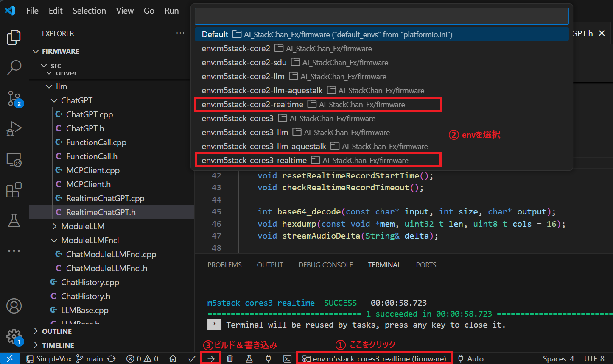

# Realtime API

- [Overview](#overview)
- [How to setup](#how-to-setup)
  - [YAML① (Wi-Fi、API key)](#yaml-wi-fiapi-key)
  - [YAML② (LLM)](#yaml-llm)
  - [YAML③ (Servo)](#yaml-servo)
  - [Build and write](#build-and-write)
- [How to use](#how-to-use)
  - [Real-time conversation](#real-time-conversation)
  - [Stopping and restarting servo operation](#stopping-and-restarting-servo-operation)
- [Function Calling and MCP](#function-calling-and-mcp)

## Overview
By using Realtime API, you can enjoy conversations with response speeds closer to real time than ever before.
Compatible with OpenAI Realtime API and Gemini Live API.

## How to setup
To enable the Realtime API, do the following:

・Create YAML files (3 types) and save them to the SD card
・Build and write

### YAML① (Wi-Fi、API key)
SD card folder：/yaml  
File name：SC_SecConfig.yaml

Set the Wi-Fi password and the Open AI API key (aiservice). STT and TTS are not used, so no settings are required.

```yaml
wifi:
  ssid: "********"
  password: "********"

apikey:
  stt: "********"       # ApiKey of SpeechToText Service (OpenAI Whisper/ Google Cloud STT 何れかのキー)
  aiservice: "********" # ApiKey of AIService (OpenAI ChatGPT / Gemini)
  tts: "********"       # ApiKey of TextToSpeech Service (VoiceVox / ElevenLabs / OpenAI 何れかのキー)
```

### YAML② (LLM)
SD card folder：/app/AiStackChanEx  
File name：SC_ExConfig.yaml

Select "0:ChatGPT" or "3:Gemini" as the LLM.  
Set enableMemory=true to enable long-term memory (recording summaries in SPIFFS).  
For details about long-term memory, see 3. Personalization in [Basic Usage](basic_usage_en.md).

```yaml
llm:
  type: 0               # 0:ChatGPT  1:ModuleLLM  2:ModuleLLM(Function Calling)  3:Gemini
  enableMemory: true    # true to enable long-term memory
```

### YAML③ (Servo)
SD card folder：/yaml  
File name：SC_BasicConfig.yaml

Configure the servo type, port, etc. according to [Basic Usage  2.1.Initial Setup with YAML](./basic_usage_en.md#sc_basicconfigyaml). If you are not using servos, you can omit this.


### Build and write
As shown below, select "env:m5stack-core2(s3)-realtime" in the VSCode (Platformio) GUI and run build and write.  




## How to use
### Real-time conversation
① After starting M5Core and the avatar is displayed, the text in the speech bubble will change from "Connecting..." to "Please touch."

② When you touch the top of the M5Core screen (around the avatar's forehead), the speech bubble will change to "Listening..." and real-time conversation will begin (Touch again to stop real-time conversation).

③ If there is no conversation for more than 30 seconds, the real-time conversation will end and the speech bubble will return to "Please touch."

### Stopping and restarting servo operation
You can stop and resume servo operation by touching near the center of the M5Core screen.

## Function Calling and MCP
Function calling and MCP implemented using function calling can also be used. By default, Function Calling enables the clock and alarm functions, allowing you to respond to requests such as "What time is it now?" or "Set an alarm for three minutes". For MCP, you need to start the MCP server on a Linux PC and configure the destination MCP server with YAML. For details, see [here](mcp.md).
