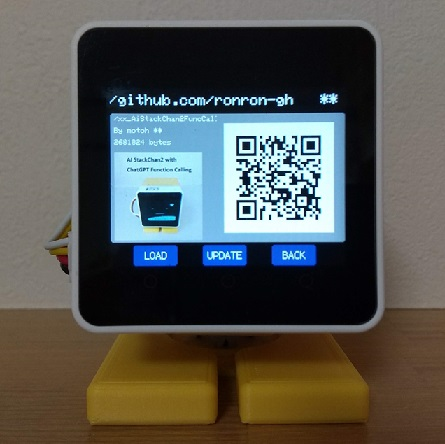

### SD Updaterに対応（Core2のみ）

SD Updaterに対応し、NoRiさんの[BinsPack-for-StackChan-Core2](https://github.com/NoRi-230401/BinsPack-for-StackChan-Core2)で公開されている他のSD Updater対応アプリとの切り替えが可能になりました。

【適用方法】  
① env:m5stack-core2-sduでビルドする。  
② ビルド結果の.pio/build/m5stack-core2-sdu/firmware.binを適切な名前（AiStackChanEx.bin等）に変更し、SDカードのルートディレクトリにコピーする。

> ・現状、Core2 V1.1ではランチャーソフトが動作しないため切り替えはできません。
