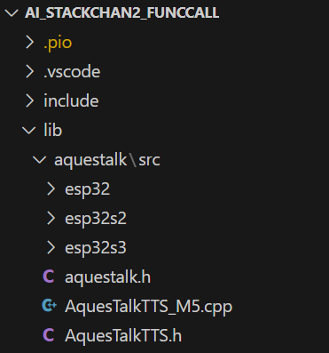
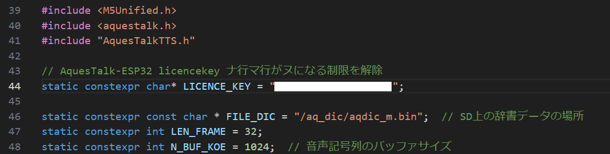
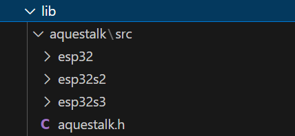
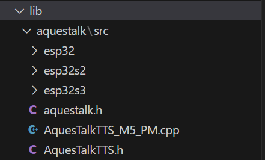
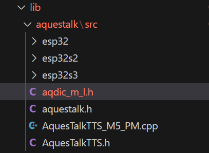
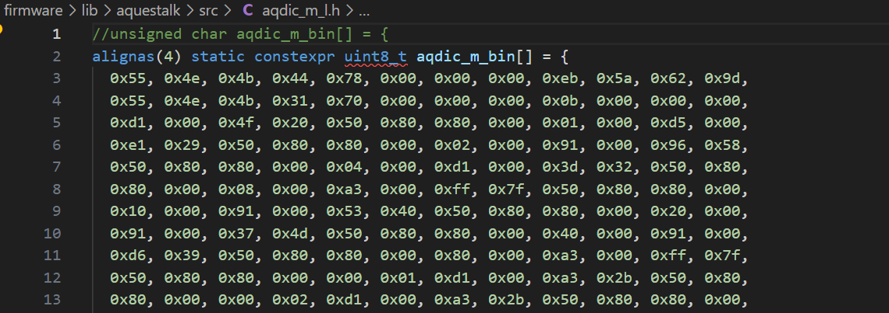

# AquesTalkを使用する場合の手順

辞書ファイルをSDカードに保存するか、プログラムに埋め込むかで、手順が異なります。M5StackはSDカードの相性があり、SDカードによっては辞書ファイルを正しく読み込めない場合があります。また、アクセス速度の面でも、SDカードよりもプログラム埋め込みの方が高速になるため、プログラムに埋め込む方法をお勧めします。

- [辞書をSDカードに保存する場合の手順](#辞書をsdカードに保存する場合の手順)
- [辞書をプログラムに埋め込む場合の手順](#辞書をプログラムに埋め込む場合の手順)


## 辞書をSDカードに保存する場合の手順

1. AquesTalk ESP32のライブラリ＆辞書ファイルをダウンロード  
   以下のURLから「AquesTalk ESP32(Small辞書版) 	」をダウンロードする。  
   https://www.a-quest.com/download.html

   ※Small辞書版でなくてもよいかもしれませんが、動作未確認です。

2. AquesTalkの使用ライセンスを購入  
   ※ライセンスがなくても評価版として使用できますが、「ナ行、マ行」の音韻がすべて「ヌ」になる制限があります。
   
3. libフォルダにダウンロードしたライブラリを展開  
   

   ※AquesTalkTTS_M5.cpp と AquesTalkTTS.h は examples\M5Stack\M5_AquesTalk_KM から持ってくる。
   
4. AquesTalkTTS_M5.cpp の変数LICENSE_KEYにライセンスキーを設定  
   

5. SDカードにダウンロードした辞書データを保存  
   ディレクトリは"/aq_dic/aqdic_m.bin"とする。
   
6. platformio.iniのbuild_flagsに以下の記述を追加  
   
   ```
   build_flags=
    -DUSE_AQUESTALK
    -Llib/aquestalk/src/esp32s2/    ※M5Core2の場合。CoreS3ならesp32s3。
    -laquestalk_s
   ``` 

## 辞書をプログラムに埋め込む場合の手順

1. AquesTalk ESP32のライブラリ＆辞書ファイルをダウンロード  
   以下のURLから「AquesTalk ESP32(Small辞書版) 	」をダウンロードする。  
   https://www.a-quest.com/download.html


2. AquesTalkの使用ライセンスを購入  
   ※ライセンスがなくても評価版として使用できますが、「ナ行、マ行」の音韻がすべて「ヌ」になる制限があります。
   
3. libフォルダにダウンロードしたライブラリを展開  
   

4. 辞書データをプログラムに埋め込むための追加ファイルをダウンロード  
   以下のURLから"M5_AquesTalk_KM_PM.zip"をダウンロードし、"AquesTalkTTS.h"と "AquesTalkTTS_M5_PM.cpp"をライブラリを展開したフォルダにコピーする。  
   https://www.a-quest.com//archive/package/M5_AquesTalk_KM_PM.zip

   
   
5. AquesTalkTTS_M5_PM.cpp の変数LICENSE_KEYにライセンスキーを設定  
   

6. 辞書データをインクルードファイル形式に変換  
   ダウンロードしたライブラリに含まれる辞書データ"/aq_dic/aqdic_m.bin"を、LinuxのxxdコマンドでC言語のインクルードファイル形式に変換する。  
   ```
   $ xxd -i aqdic_m.bin aqdic_m_l.h
   ```

   得られたaqdic_m_l.hをライブラリを展開したフォルダにコピーし、**1行目を修正する**。  

   

   
   
7. platformio.iniのbuild_flagsに以下の記述を追加  
   
   ```
   build_flags=
    -DUSE_AQUESTALK
    -Llib/aquestalk/src/esp32s2/    ※M5Core2の場合。CoreS3ならesp32s3。
    -laquestalk_s
   ``` 
